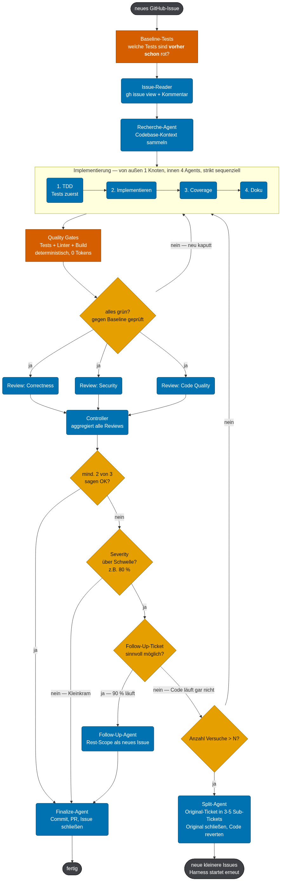
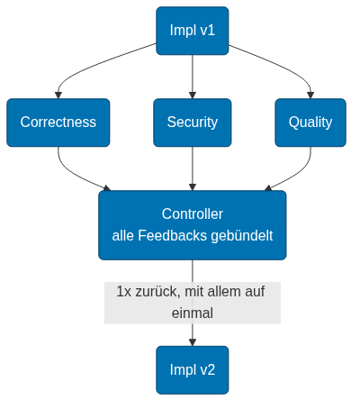
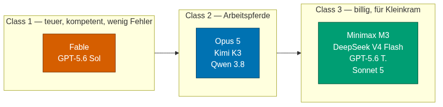

# coding-workflow

A development workflow as a skill for Claude Code. It makes sure planning
happens before building, that every claim about code carries a citation, and
that expensive models only work where they are actually needed.

> 🇩🇪 **Deutsche Fassung:** siehe Branch [`deutsch`](../../tree/deutsch).

## The problem it solves

Left to itself, a coding assistant tends to do three things: start writing
immediately, make claims about code without looking, and send the most
expensive model after every trivial task. This skill puts three habits
against that.

**Plan before implementing.** Clarify the requirement, look at the project,
present a plan — and write code only after explicit approval. A "sounds good"
is not approval.

**Cite, don't claim.** Every statement about the code names `file:line` and
quotes the line verbatim. An invented location falls apart the moment someone
looks it up; a claim without a citation carries no decision.

**The cheapest model that can do the job.** Planning and security decisions
stay with the strong model. Routine work, renames and documentation go to
cheaper ones — with a clear brief and a clear return format.

## Installation

```bash
git clone -b englisch https://github.com/xXUltraGoldXx/coding-workflow.git \
  ~/.claude/skills/coding-workflow
```

The folder name is the skill name. Called `coding-workflow`, Claude loads it
via `/coding-workflow` or on request ("please use the coding-workflow skill").

Then set your name once in `SKILL.md` — otherwise Claude replies without a
salutation:

```markdown
> **User name:** `Your name`
```

The skill stays active for the whole session. Turn it off with "workflow off"
or "normal mode".

## How it works

### Three mandatory files

They live in the project, not in the skill, and outlive the end of a session.

| File | Contents |
|---|---|
| `Context.md` | State, architecture, next steps — the entry point for picking work back up |
| `TODO.md` | Work packages, checks, open decisions, attempt counter |
| `Analyse.md` | Every finding with its citation, the proof, and the lesson |

If a session dies, "continue with @Context.md" is enough — the next run reads
the three files and carries on without repeating the analysis.

### The run as a graph, not a list

A job has exactly one responsibility. Independent jobs run in parallel; a sync
barrier goes only where a job waits on several predecessors. A node can be a
graph itself: "implementation" is one box from the outside and a chain on the
inside.



### Deterministic checks before expensive agents

Syntax checks, tests, linters and builds cost no tokens. They run first, and
they run against a **baseline**: what was already red before? Without it you
cannot tell a newly broken test from one that never passed. Running a review
agent on code that fails its gates is wasted spend.

### A review panel, not a review loop

A single reviewer who flags correctness, then security, then readability
produces four rounds. Three reviewers, each holding one perspective at the
same time, produce one.



Every finding needs `file:line`, a verbatim quote, a severity from 0 to 100
and a concrete fix. A controller then decides by fixed rules rather than by
feel. Security findings at severity 80 and above, architectural changes and
database migrations are always its own call, never a reviewer majority.

### Agent classes



The class follows the job, not the project. If a job fails twice at the same
spot, the next class up takes over — no third attempt with the same model.
After three failed rounds the task is abandoned and re-cut: three failures
point at the wrong task scope, not at a weak model.

> The diagrams are rendered from the Mermaid sources in
> `references/diagramme/mmd/`, which are English. The PNGs still carry their
> original German labels — rebuild them with
> [mermaid-cli](https://github.com/mermaid-js/mermaid-cli) if that matters to
> you.

## What is in this repository

```
SKILL.md                     the skill itself — the binding rules
references/harness.md        harness model, review panel, data contracts
references/diagramme/light/  14 diagrams as PNG
references/diagramme/mmd/    the same diagrams as Mermaid sources
```

## Adapting it

The skill is an opinion, not a law of nature. If you work differently, edit
`SKILL.md` — it is deliberately written as readable prose rather than
configuration. The obvious dials:

- **Reply language** (section "Ground rules")
- **Agent classes and models** (section 5) — the names are interchangeable
- **When the controller decides alone** (section 7.2)
- **The attempt counter** that abandons a task after three rounds

## License

MIT — see [LICENSE](LICENSE).
