# Harness Engineering — Erläuterung zum Workflow

Dieses Dokument erklärt die Regeln aus `SKILL.md` und zeigt die zugehörigen Diagramme. `SKILL.md` ist verbindlich, dieses Dokument erklärt und begründet.

Grundgedanke: Nicht das Modell allein bestimmt das Ergebnis, sondern der Ablauf, in dem es arbeitet. Dasselbe Modell erreicht in einem gut gebauten Harness ein deutlich besseres Ergebnis als im Standardablauf.

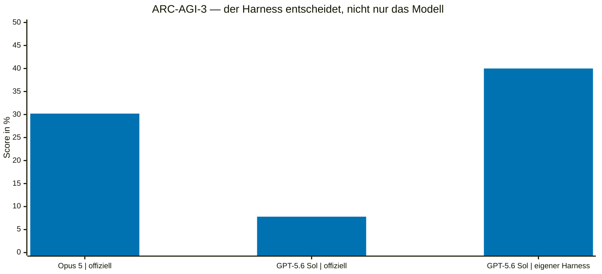

Quelle: `references/diagramme/mmd/00-benchmark.mmd`, Bild: `references/diagramme/light/00-benchmark.png`

## 1. Graph-Grammatik

Ein Ablauf besteht aus Jobs als Knoten und Datenflüssen als Kanten. Verzweigungen sind ausdrücklich formulierte Bedingungen.

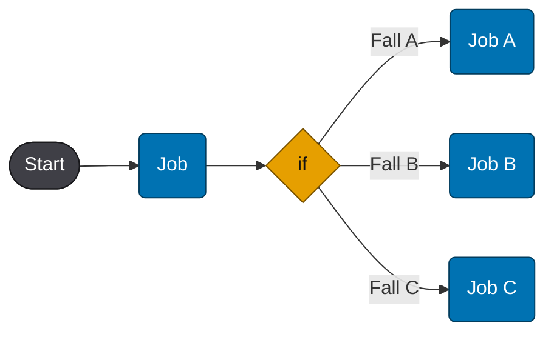

Quelle: `references/diagramme/mmd/01-graph-grammatik.mmd`, Bild: `references/diagramme/light/01-graph-grammatik.png`

Entscheidend ist die Rekursion: Jeder Knoten kann selbst ein Graph sein. Von außen ist „Implementierung“ ein Knoten, innen eine Kette oder ein Fächer aus mehreren Jobs mit anschließender Synthese.

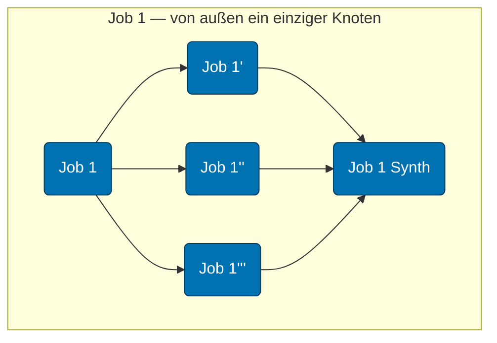

Quelle: `references/diagramme/mmd/02-job-ist-selbst-graph.mmd`, Bild: `references/diagramme/light/02-job-ist-selbst-graph.png`

Praktische Folge für die Planung: Zuerst den Graphen auf oberster Ebene festlegen, dann nur die Knoten aufklappen, die tatsächlich mehrere Jobs brauchen. Ein Knoten, der sich nicht sinnvoll aufklappen lässt, ist ein einzelner Agentenauftrag.

## 2. Der vollständige Harness

Das folgende Diagramm zeigt den Referenzablauf. Er ist die Vorlage für Abschnitt 6 und 7 in `SKILL.md`.

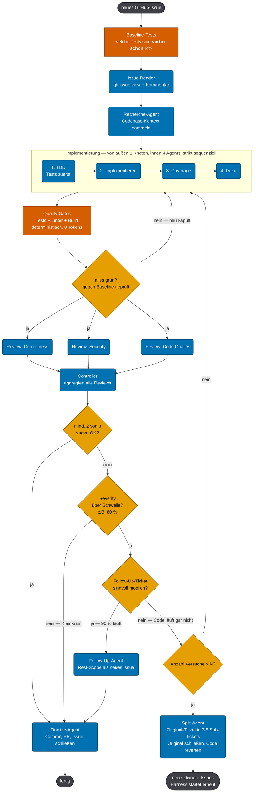

Quelle: `references/diagramme/mmd/03-autodev-harness-full.mmd`, Bild: `references/diagramme/light/03-autodev-harness-full.png`

Kompaktere Fassung desselben Ablaufs:

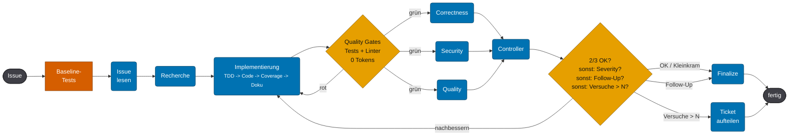

Quelle: `references/diagramme/mmd/04-autodev-harness-16zu9.mmd`, Bild: `references/diagramme/light/04-autodev-harness-16zu9.png`

Die drei tragenden Ideen:

1. Baseline zuerst. Ohne den Vorzustand ist „Test rot“ keine Information.
2. Deterministische Gates vor teuren Agenten. Tests, Linter und Build kosten keine Tokens. Ein Review-Agent auf rotem Code kostet Tokens und liefert Befunde, die der Compiler schon kannte.
3. Kein unbegrenztes Nachbessern. Entweder Mehrheit, oder Kleinkram akzeptieren, oder Rest als Follow-Up abtrennen, oder nach dem Versuchszähler die Aufgabe neu zuschneiden.

## 3. Review sequenziell gegen Review parallel

Sequenziell erzeugt jeder Reviewer eine eigene Implementierungsrunde. Vier Runden für drei Sichtweisen:

Quelle: `references/diagramme/mmd/05-review-sequenziell.mmd`, Bild: `references/diagramme/light/05-review-sequenziell.png`

Parallel mit gebündeltem Feedback: eine Runde.

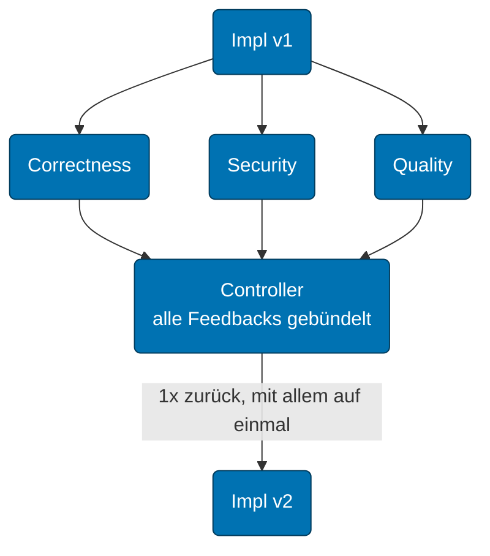

Quelle: `references/diagramme/mmd/06-review-parallel.mmd`, Bild: `references/diagramme/light/06-review-parallel.png`

Deshalb laufen die drei Reviewer in `SKILL.md` Abschnitt 7.1 gleichzeitig auf demselben Diff, und der Controller bündelt.

## 4. Controller

Der Controller entscheidet, er reviewt nicht selbst. Er bleibt im Hauptthread bei C1, weil hier die teuren Fehlentscheidungen entstehen.

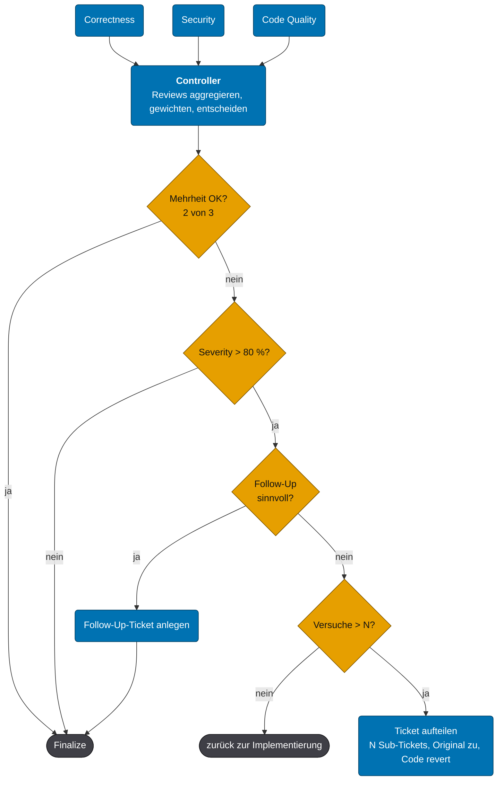

Quelle: `references/diagramme/mmd/10-controller-detail.mmd`, Bild: `references/diagramme/light/10-controller-detail.png`

Die Reihenfolge der Prüfungen ist bewusst so gewählt:

- Mehrheit vor Einzelmeinung: Ein einzelner Reviewer mit strengem Maßstab darf keine Endlosschleife auslösen.
- Severity vor Vollständigkeit: Ein Formatierungshinweis blockiert keinen fertigen Fix.
- Follow-Up vor Neuanfang: Wenn neunzig Prozent laufen, wird der Rest ein eigener Punkt und nicht die Begründung, alles zu verwerfen.
- Versuchszähler vor Beharrlichkeit: Drei gescheiterte Runden sind ein Zuschnittproblem. Die Antwort ist ein kleinerer Aufgabenschnitt, kein vierter Versuch.

Abweichung von der Vorlage: Das Zerlegen und das Verwerfen des bisherigen Stands legt der Controller dem Nutzer vor. Er tut es nicht selbstständig.

## 5. Data Contracts

Jede Kante hat ein Schema. Der Empfänger weiß dadurch, was er bekommt, und der Sender weiß, was er liefern muss.

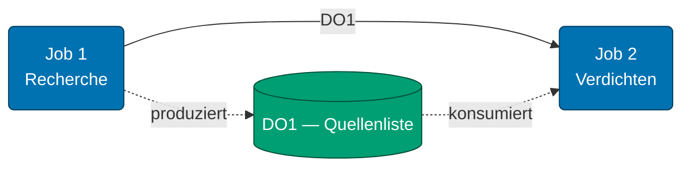

Quelle: `references/diagramme/mmd/07-data-contract-kante.mmd`, Bild: `references/diagramme/light/07-data-contract-kante.png`

Ein Schema besteht aus Objekten mit Pflichtfeldern. Entscheidend gegen Halluzination sind Identität und Belegstelle: eine `id`, ein wörtliches Zitat und ein Verweis vom abgeleiteten Fakt zurück auf seine Quelle.

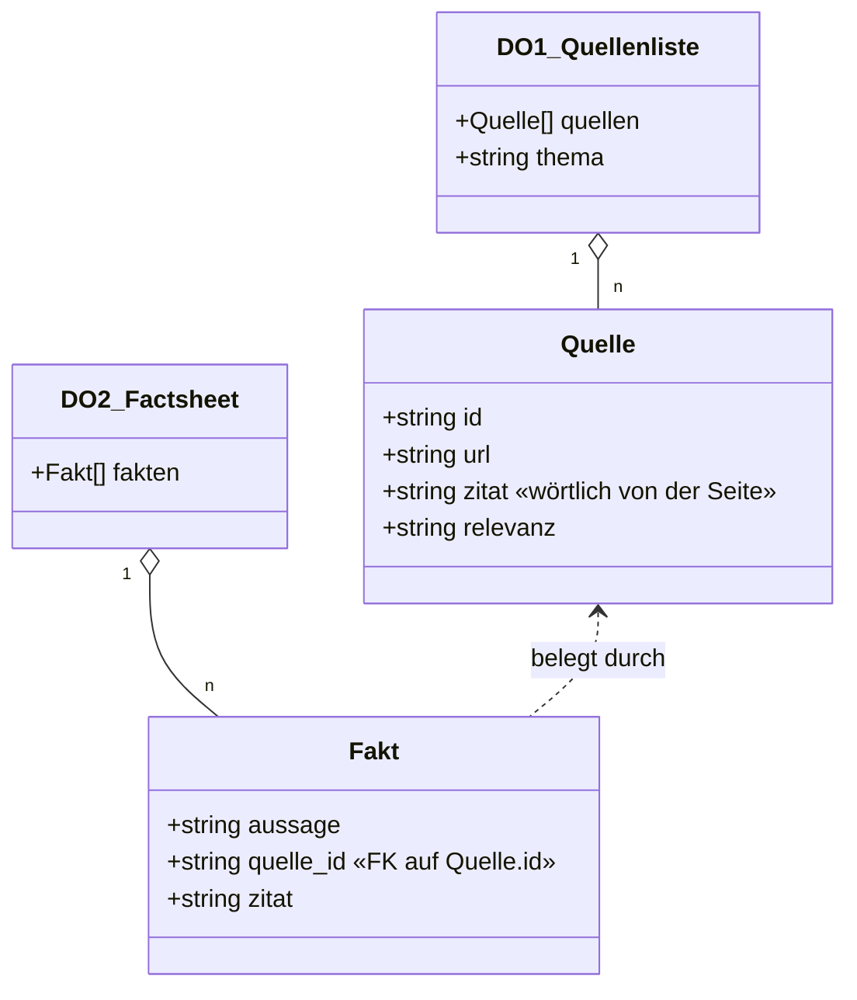

Quelle: `references/diagramme/mmd/08-data-contract-schema.mmd`, Bild: `references/diagramme/light/08-data-contract-schema.png`

Auf unseren Workflow übertragen:

- `Analyse.md` entspricht der Quellenliste. Jeder Befund hat `id`, `datei:zeile` und ein wörtliches Zitat.
- `Context.md` und Agentenberichte entsprechen dem Factsheet. Jede Aussage über den Code trägt eine `id` oder eine eigene Belegstelle.
- Review-Befunde tragen zusätzlich Schwere und Korrekturvorschlag.

Eine Aussage ohne Belegstelle ist keine Grundlage für eine Entscheidung. Das ist keine Formalität: Erfundene Fundstellen fallen beim Nachschlagen sofort auf, erfundene Prosa nicht.

## 6. Datenfluss und Ablauf getrennt planen

Zwei Fragen, zwei Graphen. Was fließt, und wer läuft wann. Vermischt man beide, entstehen Abhängigkeiten, die niemand kontrolliert.

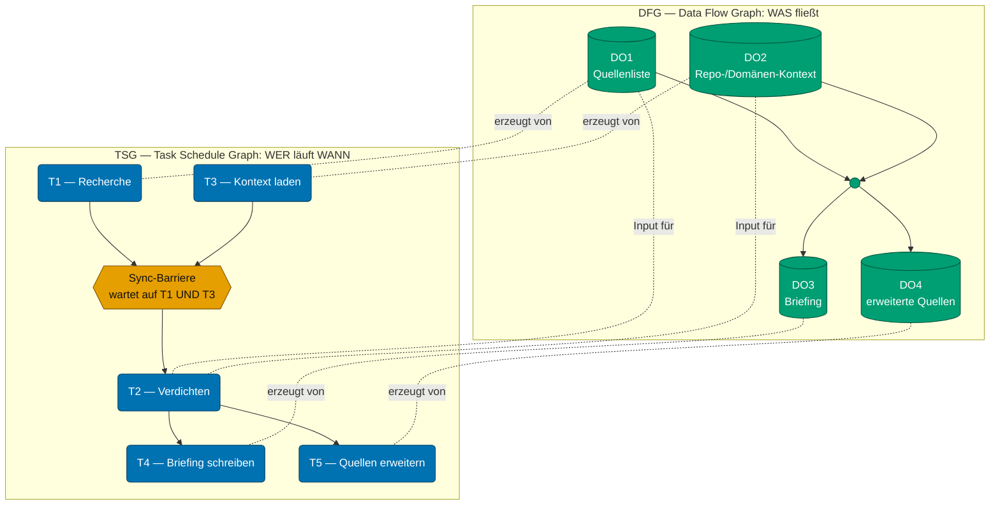

Quelle: `references/diagramme/mmd/09-dfg-ueber-tsg.mmd`, Bild: `references/diagramme/light/09-dfg-ueber-tsg.png`

Die Sync-Barriere ist der Punkt, an dem ein Job auf mehrere Vorgänger wartet. Sie muss ausdrücklich benannt werden, sonst läuft ein Agent mit halben Daten los.

## 7. Agent-Klassen

Klassen statt Modellnamen, damit die Zuordnung stabil bleibt, wenn sich die Modelle ändern.

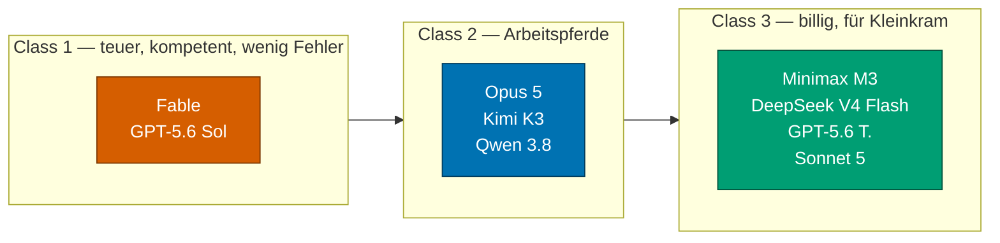

Quelle: `references/diagramme/mmd/11-agent-klassen.mmd`, Bild: `references/diagramme/light/11-agent-klassen.png`

In unserem Workflow: C1 ist Opus im Hauptthread, C2 ist Sonnet über das `Agent`-Tool, C3 ist Haiku über das `Agent`-Tool.

Die Klasse hängt am Job, nicht am Projekt:

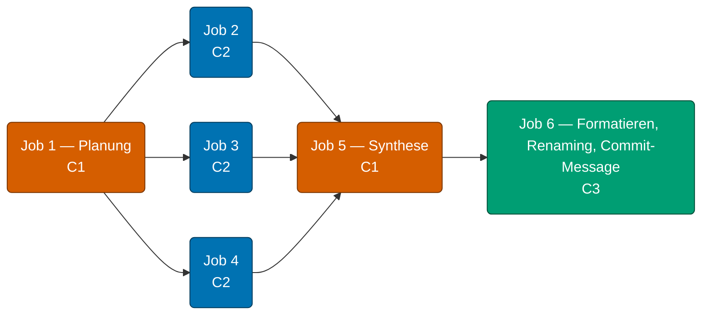

Quelle: `references/diagramme/mmd/12-klassen-zuweisung.mmd`, Bild: `references/diagramme/light/12-klassen-zuweisung.png`

Planung und Synthese sind C1, weil dort widersprüchliche Informationen bewertet werden. Die parallelen Arbeitsschritte sind C2. Formatieren, Renaming und Commit-Nachricht sind C3.

## 8. Zusammenfassung

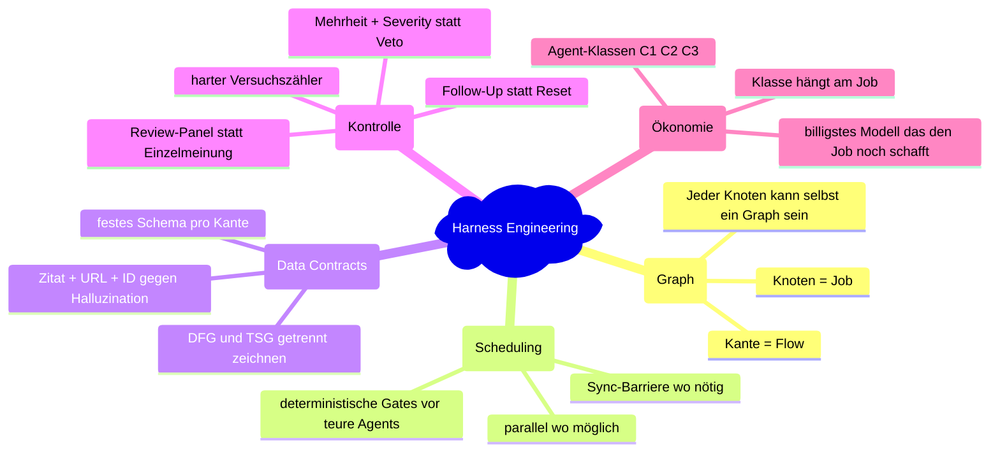

Quelle: `references/diagramme/mmd/13-zusammenfassung.mmd`, Bild: `references/diagramme/light/13-zusammenfassung.png`

## 9. Was hier bewusst anders ist als in der Vorlage

Die Vorlage beschreibt einen vollautonomen Ablauf, der aus einem GitHub-Issue heraus committet, einen Pull Request eröffnet und das Issue schließt. Unser Workflow übernimmt die Struktur, nicht die Autonomie:

- Die Umsetzung beginnt erst nach der ausdrücklichen Freigabe durch den Nutzer.
- Sicherheitsentscheidungen, Datenbankmigrationen, Architekturänderungen und Änderungen an bestehenden Kundendaten bleiben bei C1 im Hauptthread und werden nicht per Mehrheit entschieden.
- Commit, Push und Pull Request geschehen nur auf ausdrückliche Anweisung.
- Ein Follow-Up ist ein Punkt in `TODO.md`, kein automatisch angelegtes Ticket.
- Das Verwerfen eines Arbeitsstands nach dem Versuchszähler wird vorgelegt, nicht ausgeführt.
