# Harness Engineering — Explanation of the Workflow

This document explains the rules from `SKILL.md` and shows the diagrams that go with them. `SKILL.md` is binding; this document explains and justifies.

Core idea: the model alone doesn't determine the result — the flow it operates in does. The same model reaches a noticeably better result in a well-built harness than in the default flow.

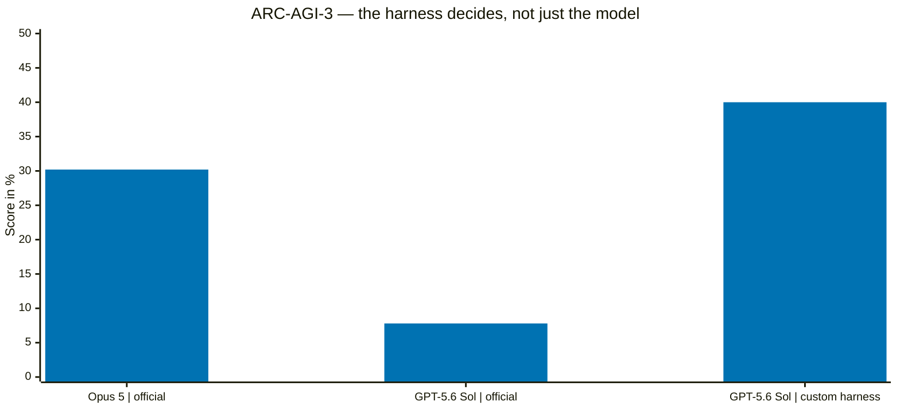

Source: `references/diagramme/mmd/00-benchmark.mmd`, image: `references/diagramme/light/00-benchmark.png`

## 1. Graph grammar

A flow consists of jobs as nodes and data flows as edges. Branches are explicitly stated conditions.

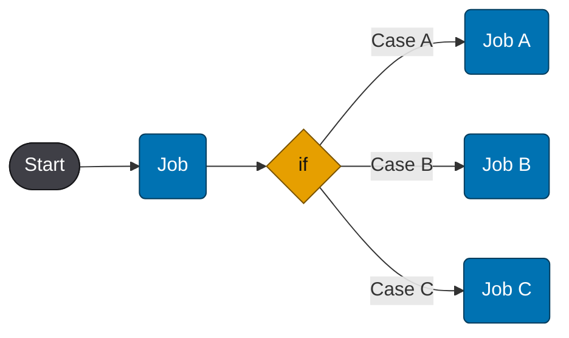

Source: `references/diagramme/mmd/01-graph-grammatik.mmd`, image: `references/diagramme/light/01-graph-grammatik.png`

The key point is recursion: any node can itself be a graph. From the outside, "implementation" is one node; on the inside it's a chain or a fan-out of several jobs followed by synthesis.

Source: `references/diagramme/mmd/02-job-ist-selbst-graph.mmd`, image: `references/diagramme/light/02-job-ist-selbst-graph.png`

Practical consequence for planning: settle the top-level graph first, then only expand the nodes that genuinely need several jobs. A node that can't meaningfully be expanded is a single agent task.

## 2. The full harness

The following diagram shows the reference flow. It is the template for sections 6 and 7 of `SKILL.md`.

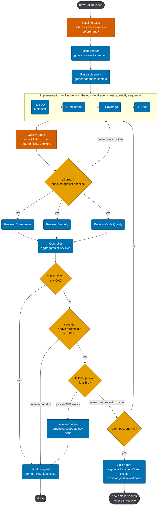

Source: `references/diagramme/mmd/03-autodev-harness-full.mmd`, image: `references/diagramme/light/03-autodev-harness-full.png`

A more compact version of the same flow:

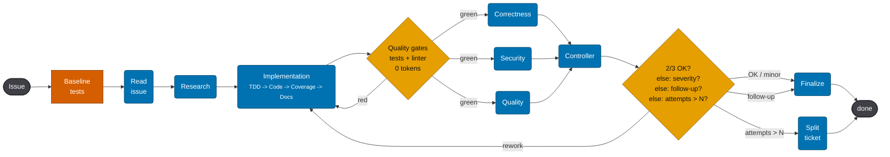

Source: `references/diagramme/mmd/04-autodev-harness-16zu9.mmd`, image: `references/diagramme/light/04-autodev-harness-16zu9.png`

The three load-bearing ideas:

1. Baseline first. Without knowing the prior state, "test is red" is not information.
2. Deterministic gates before expensive agents. Tests, linter, and build cost no tokens. A review agent on red code costs tokens and delivers findings the compiler already knew about.
3. No unbounded rework. Either a majority, or accept minor issues, or split off the remainder as a follow-up, or, once the attempt counter is hit, re-scope the task.

## 3. Sequential review vs. parallel review

Sequential: every reviewer produces its own implementation round. Four rounds for three perspectives:

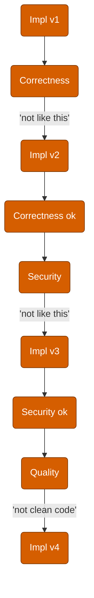

Source: `references/diagramme/mmd/05-review-sequenziell.mmd`, image: `references/diagramme/light/05-review-sequenziell.png`

Parallel with bundled feedback: one round.

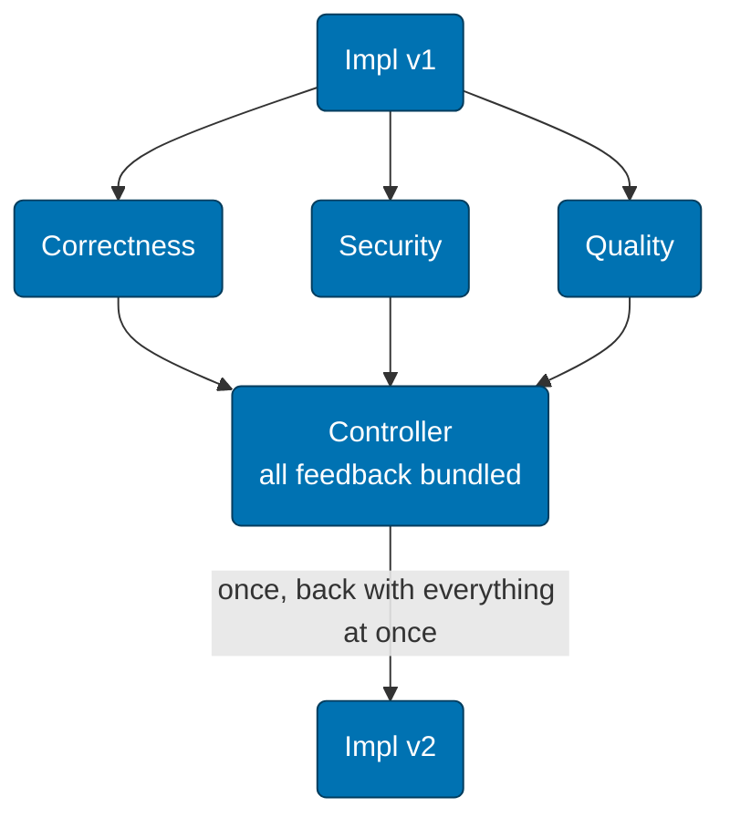

Source: `references/diagramme/mmd/06-review-parallel.mmd`, image: `references/diagramme/light/06-review-parallel.png`

That's why the three reviewers in `SKILL.md` section 7.1 run at the same time on the same diff, and the controller bundles the results.

## 4. Controller

The controller decides; it doesn't review itself. It stays in the main thread with C1, because that's where the expensive wrong decisions happen.

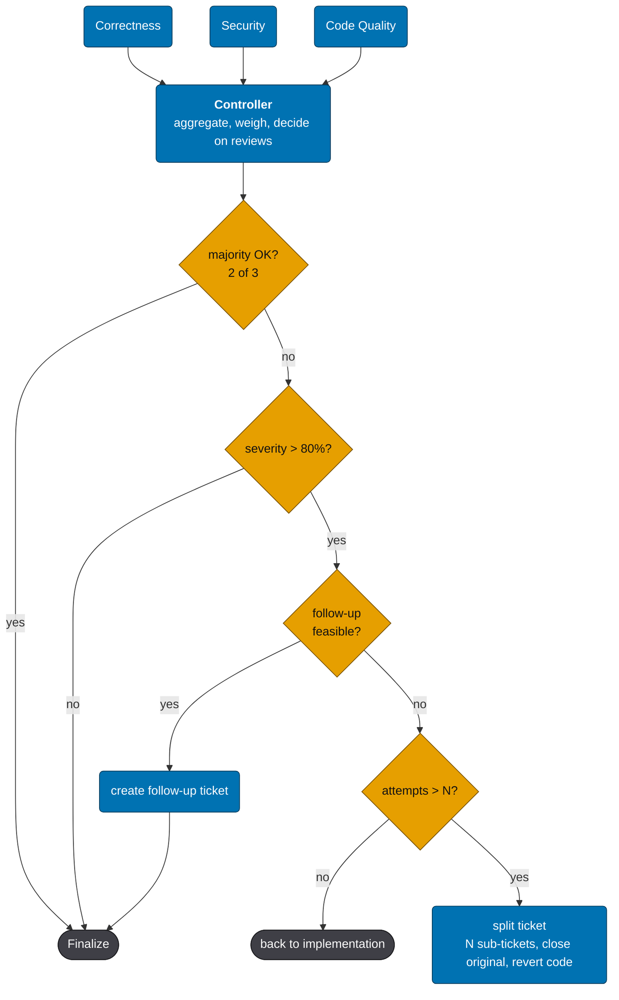

Source: `references/diagramme/mmd/10-controller-detail.mmd`, image: `references/diagramme/light/10-controller-detail.png`

The order of checks is chosen deliberately:

- Majority before a single opinion: one reviewer with a strict standard must not be able to trigger an endless loop.
- Severity before completeness: a formatting note doesn't block a finished fix.
- Follow-up before starting over: if ninety percent works, the rest becomes its own item, not the justification for discarding everything.
- Attempt counter before persistence: three failed rounds are a scoping problem. The answer is a smaller task cut, not a fourth attempt.

Deviation from the template: the controller presents splitting the task and discarding the current state to the user. It doesn't do either on its own.

## 5. Data contracts

Every edge has a schema. That way the receiver knows what it's getting, and the sender knows what it has to deliver.

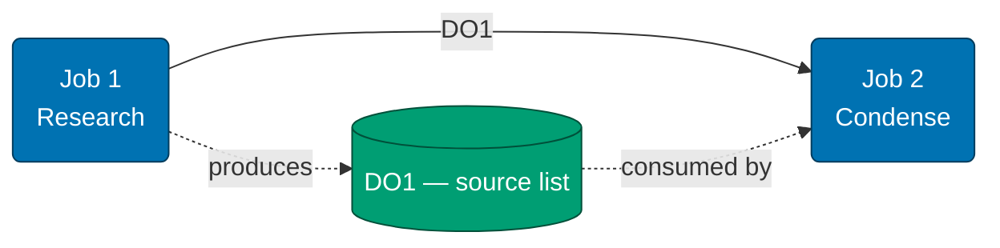

Source: `references/diagramme/mmd/07-data-contract-kante.mmd`, image: `references/diagramme/light/07-data-contract-kante.png`

A schema consists of objects with required fields. What matters against hallucination is identity and citation: an `id`, a verbatim quote, and a pointer from a derived fact back to its source.

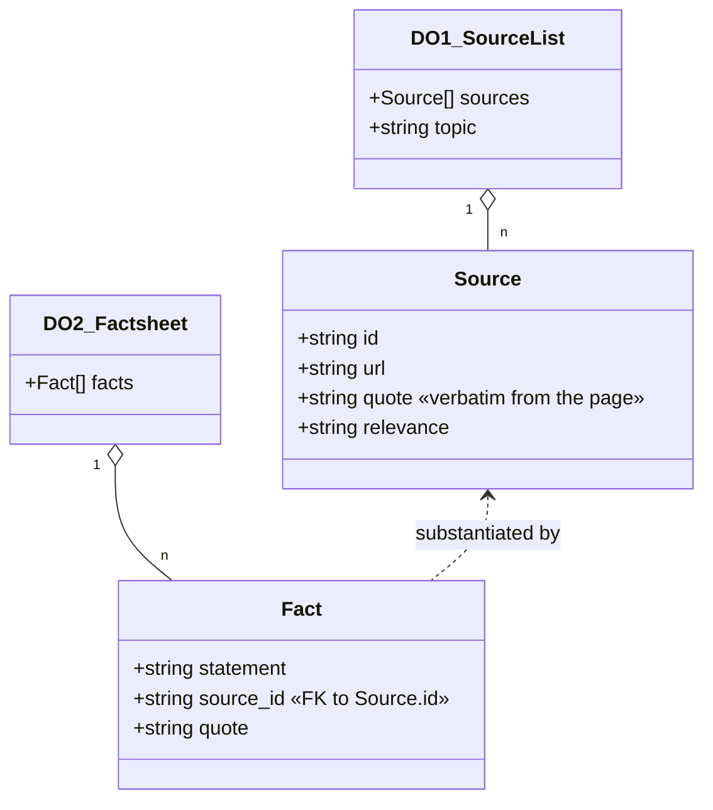

Source: `references/diagramme/mmd/08-data-contract-schema.mmd`, image: `references/diagramme/light/08-data-contract-schema.png`

Applied to our workflow:

- `Analyse.md` corresponds to the source list. Every finding has an `id`, `file:line`, and a verbatim quote.
- `Context.md` and agent reports correspond to the factsheet. Every statement about the code carries an `id` or its own citation.
- Review findings additionally carry severity and a fix suggestion.

A statement without a citation is not a basis for a decision. This isn't a formality: a made-up citation gets caught immediately when looked up; made-up prose doesn't.

## 6. Plan data flow and schedule separately

Two questions, two graphs. What flows, and who runs when. Mixing the two creates dependencies nobody controls.

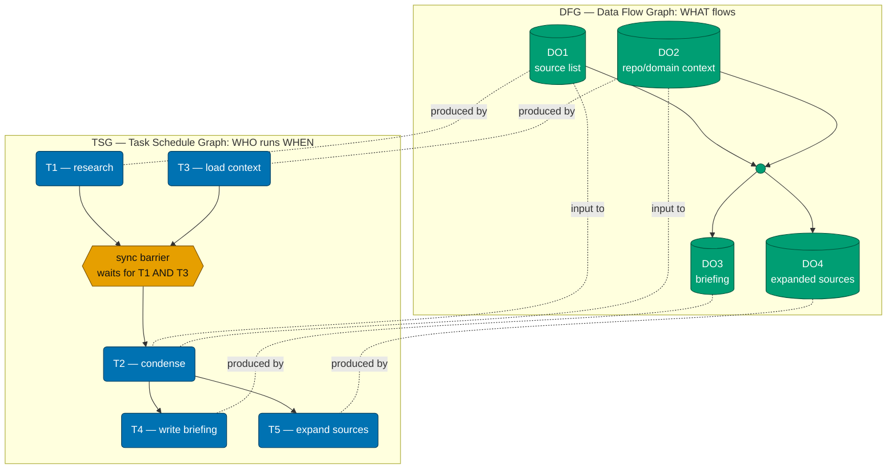

Source: `references/diagramme/mmd/09-dfg-ueber-tsg.mmd`, image: `references/diagramme/light/09-dfg-ueber-tsg.png`

The sync barrier is the point where a job waits on several predecessors. It must be named explicitly, otherwise an agent starts off with half the data.

## 7. Agent classes

Classes instead of model names, so the assignment stays stable when the models change.

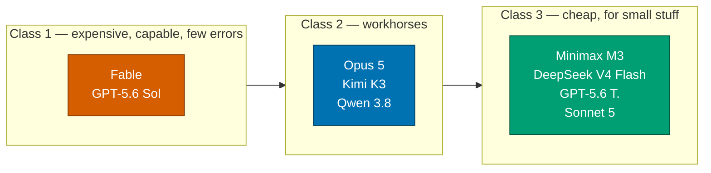

Source: `references/diagramme/mmd/11-agent-klassen.mmd`, image: `references/diagramme/light/11-agent-klassen.png`

In our workflow: C1 is Opus in the main thread, C2 is Sonnet via the `Agent` tool, C3 is Haiku via the `Agent` tool.

The class is attached to the job, not the project:

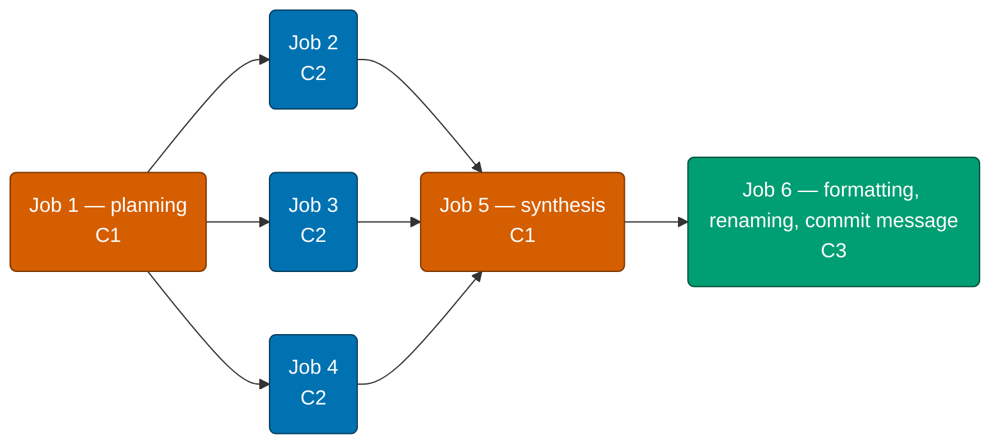

Source: `references/diagramme/mmd/12-klassen-zuweisung.mmd`, image: `references/diagramme/light/12-klassen-zuweisung.png`

Planning and synthesis are C1, because that's where conflicting information gets weighed. The parallel work steps are C2. Formatting, renaming, and commit messages are C3.

## 8. Summary

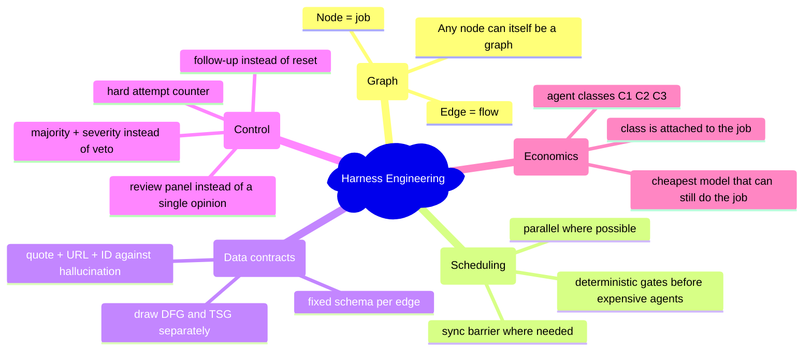

Source: `references/diagramme/mmd/13-zusammenfassung.mmd`, image: `references/diagramme/light/13-zusammenfassung.png`

## 9. What's deliberately different here from the template

The template describes a fully autonomous flow that commits straight from a GitHub issue, opens a pull request, and closes the issue. Our workflow adopts the structure, not the autonomy:

- Implementation only begins after explicit approval from the user.
- Security decisions, database migrations, architecture changes, and changes to existing customer data stay with C1 in the main thread and are never decided by majority vote.
- Commit, push, and pull request happen only on explicit instruction.
- A follow-up is an item in `TODO.md`, not an automatically created ticket.
- Discarding a work state after the attempt counter is hit gets presented to the user, not carried out.
